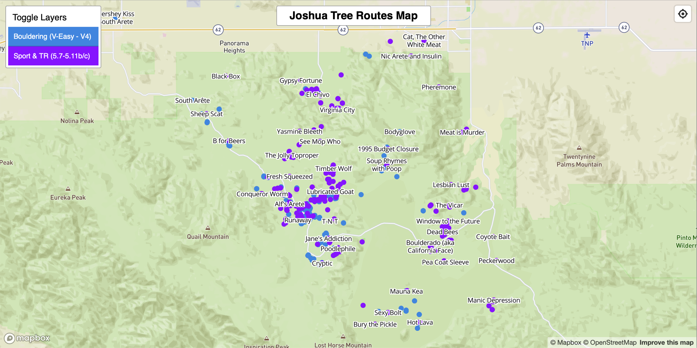

In preparation for for my first climbing trip to Joshua Tree National Park, I started researching routes and was very quickly overwhelmed by the sheer number of routes, and the difficulty of keeping track of location names I had no context for. What I really wanted was a map view that would help me identify even the general area of the park that had climbs that matched our interests and skill level.

[Mountain Project](https://www.mountainproject.com) is a great, but slightly scrappy community/app for collecting information about routes, but their mapping features couldn't display the right set of filters for our group's skill levels/interests on a map. However! They graciously allow anyone to filter/export route information as a structured dataset (CSV).

Taking the CSV of routes in Joshua Tree from Mountain Project, I converted it to a format called GeoJSON that Mapbox is designed to read using an online converter.

Once I had the GeoJSON file, using Javascript I created a simple Mapbox visualization that we could view in the browser. Mapbox was great since it is purpose built for exactly this kind of application, works on mobile and even allows the view to use GPS to locate themselves on the map from a mobile browser.

### Features
- Filter routes by Bouldering or Sport/Top Rope climbing
- Selecting a location will show you what routes start there and link to their pages on Mountain Project for more info
- Allow location access in your browser to see where you are live on the map

[Check it out!](https://erickramp.github.io/jtree-map)
